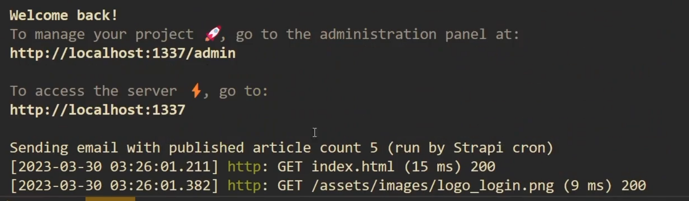
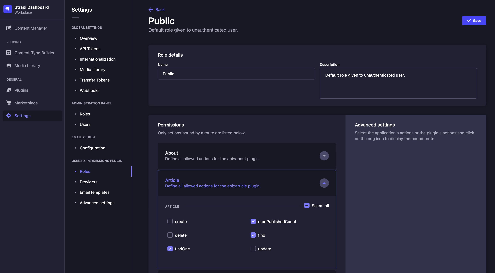

# Best Practices for Working with Strapi Cron Jobs

> Learning how to use built in Strapi Cron as well as how to horizontally scale Strapi using Cron Jobs.

This article will cover the required steps to setup a Cron Job nativally in Strapi and then also how to setup a Cron that is external to Strapi using both GitHub actions and Linux Crontab.

While Strapi's Cron feature works well for setting up a Cron Job in a simple Strapi project, it falls short when needing to scale Strapi horizontally. When scaling Strapi horizontally but still using the built in Strapi Cron, Strapi will fire a Cron Job on every instance at the same time. This can cause race conditions and unintended side affects.

Read on to learn how to setup a Cron Jon in Strapi and also how to avoid issues with Cron Jobs when horiztonally scaling.

## Prerequisites

Before you can jump into this content, you need to have a basic understanding of the following.

1. Basic knowledge of JavaScript
2. A Node.js ready environment
3. Basic understanding of Strapi - get started here

## What is Strapi

Strapi is an open-source headless CMS based on Node.js that is used to develop and manage content using a Restful API and/or GraphQL.

With Strapi, we can scaffold our API faster and consume the content via APIs using any HTTP client or GraphQL enabled frontend.

## Scaffolding a Strapi project

To scaffold a new Strapi project is very simple and works precisely as installing a new frontend framework.

We are going to start by running the following commands and testing them out in our default browser.

```javascript
npx create-strapi-app strapi-api --quickstart
# OR
yarn create strapi-app strapi-api --quick start
```

The command above will scaffold a new strapi project in the directory you specified.

Next, run yarn build to build your app and yarn develop to run the new project if it doesn't start automatically.

The last command will open a new tab with a page to register your new admin of the system. Go ahead and fill out the form and click on the submit button to create a new Admin.

## Creating a Cron Job in Strapi

In order to create a Cron Job in Strapi there are two files that we need to add / modify. First we will create a [cron-task.js](https://github.com/BraydenGirard/strapi-cron-best-practices/blob/main/config/cron-tasks.js) file and then we will enable the cron job by editing the [server.js](https://github.com/BraydenGirard/strapi-cron-best-practices/blob/main/config/server.js) file. If you need more information on using Cron jobs in strapi you can find the [Cron Job documentation here](https://docs.strapi.io/dev-docs/configurations/cron).

For this demonstration of a Strapi Cron Jobs we will assume that we have a blog setup in Strapi, the code for the demonstration is [here](https://github.com/BraydenGirard/strapi-cron-best-practices). What we want to achieve is to receive a notification daily (or at a certain cadence) to let us know how many articles have been published. This could be useful if you have a writer that is writting articles and you want to kee track of how many they have produced and published.

The code below illustrates what should be in the [cron-task.js](https://github.com/BraydenGirard/strapi-cron-best-practices/blob/main/config/cron-tasks.js) file that you create in your `config` folder. This file has two important properties, one is the task that gets run by the Cron and the other is the timer for the Cron (how often the task should be run). The logic in the task gets the count of all published posts and then logs that out and sends an email. The schedule property is set so that this Cron runs once every minute (in this case for demo purposes) but in our real world application we would want to adjust this to a daily frequency.

```javascript
module.exports = {
  postCountEmail: {
    task: async ({ strapi }) => {
      const count = await strapi.entityService.count("api::article.article", {
        publicationState: "live",
      });

      console.log(
        `Sending email with published article count ${count} (run by Strapi cron)`
      );

      try {
        await strapi.plugins.email.services.email.send({
          to: "brayden@gmail.com",
          from: "noreply@strapi.com",
          subject: "Post count",
          text: `You have ${count} published articles`,
          html: `You have ${count} published articles`,
        });
      } catch (err) {
        // Commented out for demo purposes
        //console.error(err);
      }
    },
    options: {
      // Every minute
      rule: "*/1 * * * *",
    },
  },
};
```

Now to activate the Cron that we just created we have to edit the [server.js](https://github.com/BraydenGirard/strapi-cron-best-practices/blob/main/config/server.js) file to add the `cron` property. The code snippet for this is below.

```javascript
const crontTasks = require("./cron-tasks");

module.exports = ({ env }) => ({
  host: env("HOST", "0.0.0.0"),
  port: env.int("PORT", 1337),
  cron: {
    enabled: env.bool("CRON_ENABLED", true),
    tasks: crontTasks,
  },
  app: {
    keys: env.array("APP_KEYS"),
  },
  webhooks: {
    populateRelations: env.bool("WEBHOOKS_POPULATE_RELATIONS", false),
  },
});
```

To test out this Cron we can run: `npm run strapi develop`

Once the Cron runs we will see the output in the console as shown below.



So far we have learnt how to setup Cron jobs natively in Strapi. The only issue with running Cron jobs in Strapi like this is if we decide to horizontally scale our Strapi instances. When horizontally scaling, typically several instances of Strapi will be running on different servers all behind a load balancer. While the load balancer distributes the incoming requests to one instance at a time, the Strapi Cron will run on all instances at once. When this happens, each of the running Strapi instances will race to run the same Cron at the same time. This can cause all kinds of problems. In our demonstration scenerio this would cause our server to send out several emails for each run of the Cron job. We definitely don't want to receive 12 emails just because we have 12 Strapi instances running. So how can we ensure that this does not happen?

## Horizontally Scaling Strapi with External Cron Jobs

Since we can not use built in Strapi Cron jobs while horizontally scaling Strapi, we will move this Cron job outside of Strapi. An external service will trigger on a Cron schedule which will then need a way to call an endpoint in Strapi. We can create our own custom route that when called will then trigger a custom controller to be run. This custom controller will replace the logic that we use in our [cron-task.js](https://github.com/BraydenGirard/strapi-cron-best-practices/blob/main/config/cron-tasks.js) file above.

First let's create the custom route in Strapi. To do this we need to create a new file under the `src/api/article/routes` folder. We will name this file [0-custom-article.js](https://github.com/BraydenGirard/strapi-cron-best-practices/blob/main/src/api/article/routes/0-custom-article.js). The reason we prefix the file name with a 0 so that this route gets loaded before the built-in routes. The code required in this file to create a custom route in Strapi is show below.

```javascript
module.exports = {
  routes: [
    {
      method: "GET",
      path: "/articles/cron/published-count",
      handler: "api::article.article.cronPublishedCount",
    },
  ],
};
```

The above custom route points to the `cronPublishedCount` method in our custom controller. Next we will create this custom controller by adding it to the existing [article.js](https://github.com/BraydenGirard/strapi-cron-best-practices/blob/main/src/api/article/controllers/article.js) controller file which is located in the `src/api/article/controller` folder. The logic we will add to this file basically does the exact same thing that our built-in Strapi Cron task did.

```javascript
"use strict";

/**
 *  article controller
 */

const { createCoreController } = require("@strapi/strapi").factories;

module.exports = createCoreController("api::article.article", ({ strapi }) => ({
  async cronPublishedCount(ctx) {
    const count = await strapi.entityService.count("api::article.article", {
      publicationState: "live",
    });

    console.log(
      `Sending email with published article count ${count} (run by external cron)`
    );

    try {
      await strapi.plugins.email.services.email.send({
        to: "brayden@notarealemail123.com",
        from: "noreply@strapi.com",
        subject: "Post count",
        text: `You have ${count} published articles`,
        html: `You have ${count} published articles`,
      });
    } catch (err) {
      // Commented out for demo purposes
      // console.error(err);
    }
    ctx.status = 200;
  },
}));
```

Now that we have our custom route and controller built in Strapi, we have to call this route externally from Strapi. There are many different ways to accomplish this but we will look at two popular options.

### Using Crontab

The first simple way to schedule a Cron which will call an endpoint is to use Crontab. If you're on a Linux machine or you have a Linux VPS, Crontab is already built in. All you have to do is run the command `crontab -e` which will open the Crontab file for editing. In this file we want to make a curl request to that custom route in Strapi in order to trigger our custom controller. See the snippet below for what this would look like.

```bash
*/1 * * * * curl -s https://your-publi-url.com/api/articles/cron/published-count
```

Don’t forget to make your Strapi custom route available to the public in the Strapi Admin. Showing the picture below.



You shoud now have a running Cron that is external to Strapi. If you run your Strapi project in development mode and then forward a tunnel with something like [Ngrok](https://ngrok.com) to your local development machine, you should be seeing your Cron working and logging.

### Using GitHub Actions

Another option for setting up a Cron job that is external to Strapi is by using GitHub actions. GitHub actions can be setup so that they are triggered on a Cron schedule. Since a GitHub action is basically a job that is run on a Linux machine, you can have that job run Linux commands. We simply need to run the curl command to call our custom Strapi route. If your code is hosted on GitHub, you simply need to create a file with contents similar to the snippet below that is in the following path: `.github/workflows/cron.yml`

```yml
name: post-count-cron
on:
  schedule:
    - cron: ‘*/5 * * * *'
  workflow_dispatch:
jobs:
  cron:
    runs-on: ubuntu-latest
    steps:
      - name: Get request to the custom Strapi route
        run: |
          curl -s https://your-publi-url.com/api/articles/cron/published-count
```

Since GitHub actions only allow you to run at a minimum interval of 5 minutes, we have used 5 minutes as the example above.

## Wrap Up

Hopefully this article has provided some helpful information on the best practices for working with Cron Jobs in Strapi. If you simply need to run a single instance of Strapi, you can easily setup the built in Strapi Cron Jobs. When you need to horizontally scale your Strapi insatances, you now have a couple examples of options that are available. Thanks for reading through this article and if you have any other questions please leave a comment below!
